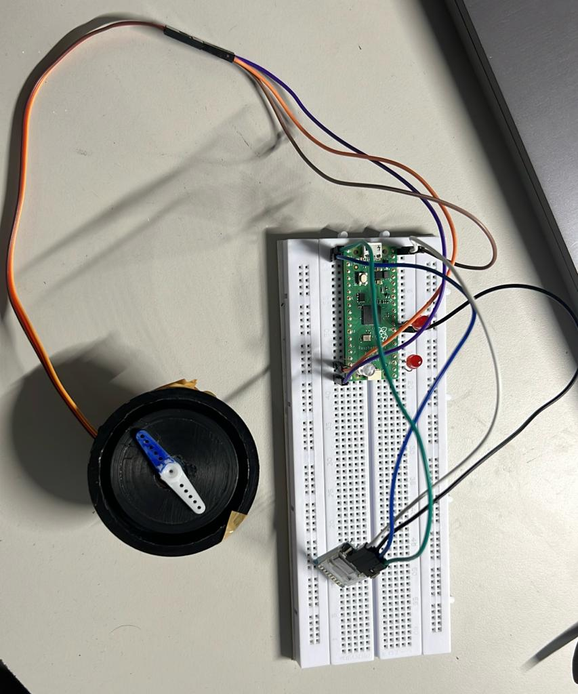
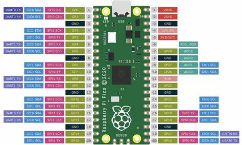

# Table of Contents

  -   [Creating a Handwritten Digit Classification System with Raspberry Pi Pico](#creating-a-handwritten-digit-classification-system-with-raspberry-pi-pico)
  - [Project Overview](#project-overview)
  - [Project Inspiration](#project-inspiration)
  - [Required Hardware](#required-hardware)
  - [Required Software](#required-software)
  - [Installation and Setup](#installation-and-setup)
  - [Running and Debugging](#running-and-debugging)
  - [Raspberry Pi Pico Pin Diagram](#Raspberry-Pi-Pico-Pin-Diagram)
  - [Wiring](#wiring)

## Project Overview

In this project, we aim to develop a system that uses a Raspberry Pi Pico to run a servo 90 mm motor based on the values of the user given in an Blutooth HC-05 module It even detects the objects in front of it based on th egiven distances. [YouTube link](https://youtube.com/shorts/A1B2NVO9zRE?si=7lx_FeOTXM0ylfeC)

## Project Inspiration

This project drew inspiration from [Handwritten digit classification using Raspberry Pi Pico and Machine Learning](https://ashishware.com/2022/09/03/pipico_digit_classification/). While the core idea remains similar, several necessary changes and enhancements have been made to adapt it to our specific requirements and goals.

## Required Hardware

1. **Raspberry Pi Pico**: This project is designed for the Raspberry Pi Pico, but it may work on other boards that support CircuitPython with some modifications. Ensure your board has sufficient GPIO pins, as almost 80% of the Pi Pico's GPIOs are used.

2. **servo 90 mm motor**: You'll need aservo 90 mm motor for the angle to rotate.

3. **Bluetooth HC-05**: This blue tooth module takes the values from the mobile app 

4. **Full-sized breadboard (highly recommended)**: A breadboard facilitates connections between components.

5. **Jumper Cables**: You'll need male-to-female (M-F) and male-to-male (M-M) jumper cables for making various connections.

## Required Software

1. **Any text editor**: You'll need a text editor for editing the code if necessary.

3. **Patience**: Building and fine-tuning this system may require some patience.

## Installation and Setup

1. **Install thonny**: Install Thonny software.

2. **Download Necessary Library Files**: Visit the CircuitPython website to download the necessary library files. Alternatively, you can obtain these files from the website and paste them into the "lib" folder on your board.

4. **Copy `servo.py` File**: Copy the servo.py file and paste it in the thonny ide.

## Running and Debugging

To run and debug your code, follow these steps:

1. Use an Integrated Development Environment (IDE), preferably Thonny IDE.

2. Ensure that your Raspberry Pi Pico is connected to your computer.

3. Refer to the connection details provided below for proper setup and debugging.

Please note that you'll need to configure your IDE to work with your Raspberry Pi Pico for effective code development and debugging.

## Raspberry Pi Pico Pin Diagram

## Wiring

For this project, a substantial amount of wiring is required. It is highly recommended to use breadboards and jumper cables for a clean and organized setup.

### PICO CONNECTIONS

Pin	Name	Function
0-27	GPIO0-27	General-purpose input/output
28-30	ADC0-2	Analog inputs
31-32	RX/TX (UART0)	Serial communication
33-34	RX/TX (UART1)	Serial communication
35-36	SPI0 SCLK/MISO	SPI bus 0
37-38	SPI0 MOSI/CS	SPI bus 0
39-40	I2C0 SCL/SDA	I2C bus 0
41-42	I2C1 SCL/SDA	I2C bus 1
USB	USB	Power and programming

## Wrapping It Up

In this project, we set pico board and connect it with the servo motor with sensor we calculate the distance of the object and based on the distance of the object with the sensor the motor changes it angles

in the same way have implemented a program with the bluetooth HC-05 

